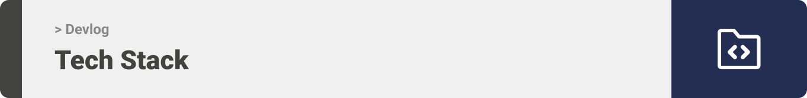

<div align="center">

> Devlog is a web application built to make blogging an easy and accessible task to all developers

**[PROJECT PHILOSOPHY](#philosophy) • [WIREFRAMES](#wireframes) • [TECH STACK](#tech) • [IMPLEMENTATION](#implementation) • [HOW TO RUN?](#install)**

</div>

<br><br>


> Developers spend a lot of time trying to achieve a goal, fixing a bug, or refactoring code

> The idea behind Devlog is to be the go to place for devs, a place where they can write down their thoughts, or document their latest ideas around a community that share their same interests

Reasons why developers should blog:

- Teaching others will improve your skills and make you a better programmer
- blog posts are a great medium for developers to learn and share their ideas
- blogs are a way to staying up to date in the continuously evolving tech space
- writing based around technical words isn't always easy task, blogging can improve a developers writing and communication skills

<br><br>



A brief high-level overview of the tech stack used in the Devlog web app:

- Frontend: Devlog uses [React](https://reactjs.org), a javascript library for building user interfaces.
  The styling of individual components was done using [SASS](https://sass-lang.com/), a preprocessor scripting language that is interpreted or compiled into Cascading Style Sheets (CSS).
- Backend: Devlog uses [Node.js](https://nodejs.org/en) and [Express](https://expressjs.com/).
  Node.js is an open-source, server-side, JavaScript runtime environment that is solely based on the V8 JavaScript Chrome Engine. Node.js can be used to create a variety of applications, including Command-Line Applications, Web Applications, Real-time Chat Applications, and REST API Servers.
  Express is a node js web application framework that provides broad features for building web and mobile applications. It is used to build a single page, multipage, and hybrid web application. It's a layer built on the top of the Node js that helps manage servers and routes.
- For persistent storage, the app uses [MongoDB Atlas](https://www.mongodb.com/atlas/database). A Multi-Cloud Database Service offered by MongoDB that simplifies Database Deployment and Management while providing the flexibility required to build resilient and performant global applications on the Cloud providers of your choice.

<br><br>


> To get a local copy up and running follow these simple steps.

### Prerequisites

- Download and install [Node.js](https://nodejs.org/en/)

- npm
  ```sh
  npm install npm@latest -g
  ```

### Installation

1. Clone the repo
   ```sh
   git clone https://github.com/omar-zeineddine/devlog
   ```
2. Navigate to the backend folder and install dependencies
   ```sh
   cd backend
   npm install
   ```
3. Navigate back and enter the frontend folder and install dependencies

   ```sh
   cd .. && cd frontend
   npm install
   ```

4. Run the web app
   ```sh
   cd backend
   npm run dev
   ```
